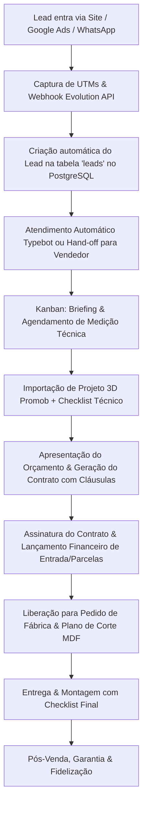

# 🏗️ Arquitetura do Sistema — Dumar Móveis Planejados

Este documento detalha a arquitetura holística da aplicação **Dumar Móveis Planejados**, abrangendo a camada pública de captação de clientes, o CRM operacional de marcenaria sob medida, as integrações de mensageria e o ecossistema de agentes especialistas.

---

## 🏢 1. Visão Geral da Plataforma

A plataforma da Dumar Móveis Planejados é uma solução full-stack moderna composta por dois núcleos principais:

1. **Plataforma Pública (Marketing & Captação)**:
   - Landing Page institucional de alto padrão com Hero interativo, galeria de projetos concluídos, apresentação do processo fabril, vídeos reais de marcenaria, formulários de orçamento sob medida, agendamento de medição técnica e botão de atendimento direto via WhatsApp.
   - Rastreamento dinâmico de tráfego pago (UTM Tracker para Google Ads, Meta Ads e canais orgânicos).

2. **CRM Operacional e Financeiro (Marcenaria 360°)**:
   - Funil de Vendas e Produção no formato Kanban com 11 estágios especializados (da entrada à assistência pós-venda).
   - Integração com **Evolution API** para atendimento multicanal via WhatsApp (troca de mensagens em tempo real, disparo de áudios PTT, envio de plantas em PDF, fotos de obras e fotos de projetos 3D).
   - Integração com **Typebot** e **n8n** para triagem automatizada de leads e extração de ambientes desejados (Cozinha, Suíte, Closet, Sala, etc.).
   - Módulo de Contratos Digitais com geração automática em tempo real, visualização/impressão com cláusulas de marcenaria, dados de MDF, pagamento e prazos.
   - Módulo Financeiro com controle de fluxo de caixa, parcelamentos, PIX, entradas e despesas operacionais.
   - Leitor e processador de arquivos de projeto **Promob**.
   - Agenda de visitas técnicas e cronograma de montagens.

```
┌─────────────────────────────────────────────────────────────────────────────┐
│                            FRONTEND (React 18 + Vite)                       │
│  ┌─────────────────────────────┐         ┌───────────────────────────────┐  │
│  │   Landing Page & Captação   │         │   CRM Operacional Marcenaria  │  │
│  │  (/, /orcamento, /contato)  │         │   (Kanban, Drawer, Contratos) │  │
│  └──────────────┬──────────────┘         └──────────────┬────────────────┘  │
└─────────────────┼───────────────────────────────────────┼───────────────────┘
                  │ API REST / JSON                       │ Webhooks & Events
┌─────────────────▼───────────────────────────────────────▼───────────────────┐
│                           BACKEND (Node.js Express + TS)                    │
│  ┌───────────────────────────┐             ┌─────────────────────────────┐  │
│  │   Storage / ORM Drizzle   │             │   Integrações & Webhooks    │  │
│  │   (PostgreSQL / pgPool)   │             │   (Evolution API, Typebot)  │  │
│  └──────────────┬────────────┘             └──────────────┬──────────────┘  │
└─────────────────┼─────────────────────────────────────────┼─────────────────┘
                  │                                         │
┌─────────────────▼──────────────┐         ┌────────────────▼─────────────────┐
│     PostgreSQL Database        │         │   Serviços Externos (VPS/Cloud)  │
│  - leads, users, contracts     │         │   - Evolution API (WhatsApp)     │
│  - financial, calendar, tpl    │         │   - n8n Workflows / Typebot      │
└────────────────────────────────┘         └──────────────────────────────────┘
```

---

## 👥 2. Tabela de Agentes Especialistas

| Agente | Responsabilidade Primária | Tecnologias & Ferramentas Chave |
|---|---|---|
| **Orchestrator** | Gestão do ciclo de vida das tarefas, coordenação multi-agente, garantia de integridade e aprovação de entrega. | Git, PowerShell, Planejamento Antigravity |
| **Frontend UI/UX Specialist** | Desenvolvimento e estilização de interfaces, animações, responsividade e componentes visuais. | React 18, Tailwind CSS, Radix UI, Framer Motion, Wouter, Lucide Icons |
| **Backend & API Engineer** | Endpoints REST, autenticação de usuários, lógica de webhooks, comunicação com Evolution API e manipulação de arquivos. | Express, Node.js, TypeScript, Crypto, Fetch API, Vision API |
| **Database Architect** | Modelagem de dados, evolução do schema, integridade de JSON fields, queries otimizadas e migrações. | Drizzle ORM, Drizzle-Kit, PostgreSQL, Drizzle-Zod |
| **Marcenaria Domain Expert** | Regras de fabricação de móveis sob medida, etapas de medição, checklist de obra, plano de corte, orçamentação e contratos. | Promob Parser, Regras Contratuais Dumar |
| **Automation Integrator** | Fluxos de mensageria WhatsApp, automação de leads com Typebot, n8n webhook routing e rastreio de campanhas. | Evolution API v2, Typebot Engine, n8n Workflows, UTM Tracker |

---

## 📚 3. Catálogo de Skills

| Skill | Escopo de Atuação |
|---|---|
| **`dumar-moveis-core`** | Skill central com todas as rotas, componentes, modelos de banco, regras do funil de marcenaria e scripts de deploy da Dumar Móveis Planejados. |
| **`modern-web-guidance`** | Padrões de design visual refinado, acessibilidade, performance e arquitetura limpa de componentes React. |

---

## 🔄 4. Fluxo de Trabalho e Ciclo de Vida da Informação



---

## ✅ 5. Mapa de Validação e Qualidade

Antes de qualquer entrega ou deploy em produção na VPS (`deploy-dumar.ps1`):
1. **Verificação Estática de Tipos**: `npm run check` (TypeScript Compiler).
2. **Validação do Schema Drizzle**: Garantir que as tabelas em `shared/schema.ts` estejam sincronizadas com o banco via `npm run db:push`.
3. **Build do Frontend e Backend**: `npm run build` (Vite Build + Esbuild Node bundle).
4. **Verificação de Segurança**: Sanitização de variáveis de ambiente (`.env`), sem exposição de chaves privadas em logs.
